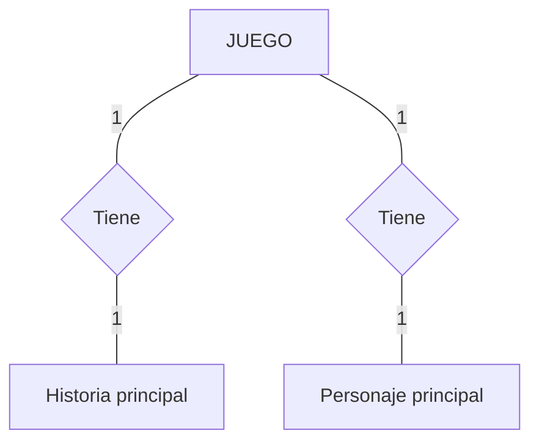
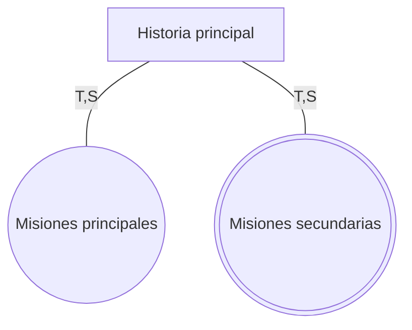
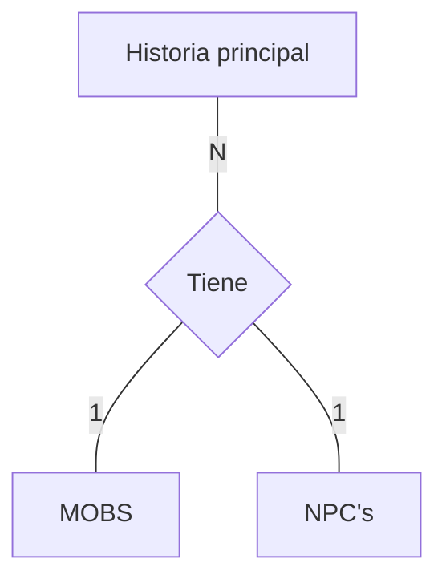
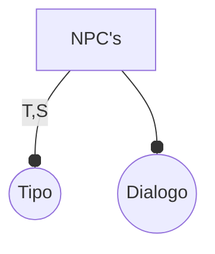
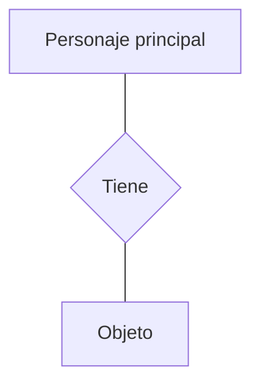

## 1. Entidad Juego


## 2. Superclase Historia principal


## 3. Relación entidad Historia Principal -- NPC's & MOBS

 
## 4. Superclase Mobs
 ```mermaid
flowchart TD
A[MOBS] --o |T,S|B((Tipo))
A --- C((Nivel))
A --- D((Daño))
```
## 5. Superclase NPC's

## 6. Relación entidad Personaje principal -- Objetos

## 7. Superclase objetos 
```mermaid
flowchart TD

```
## 8. Relación Personaje principal - Habilidad
 ```mermaid
flowchart TD

```
## 9. Subclase habilidades
```mermaid
flowchart TD

```
